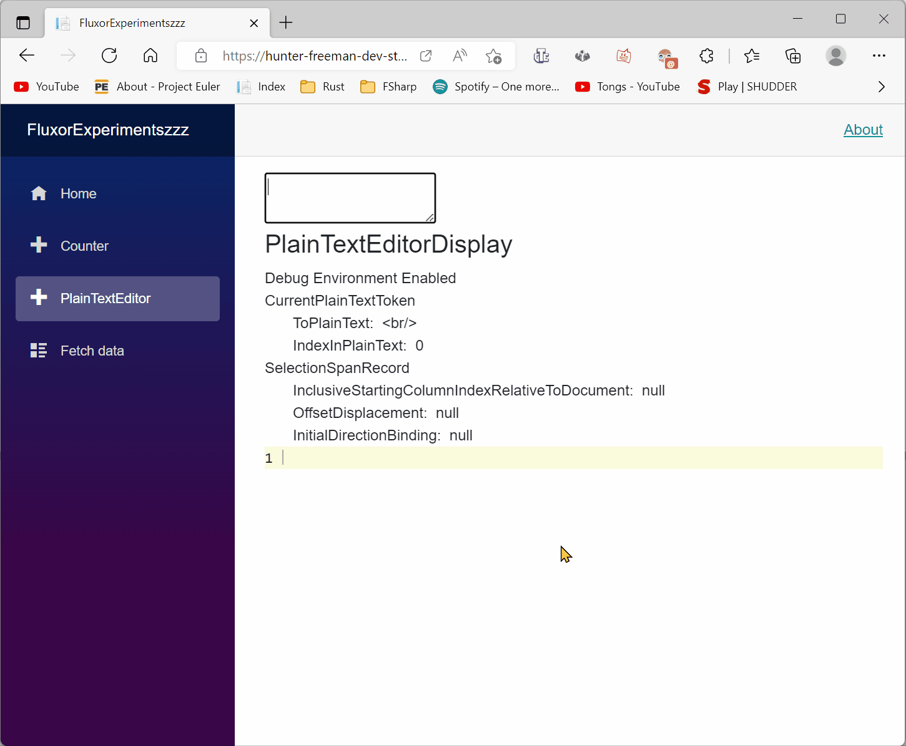
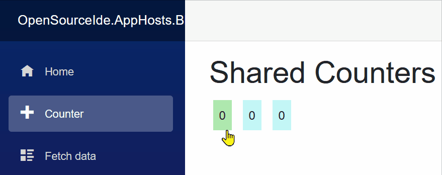
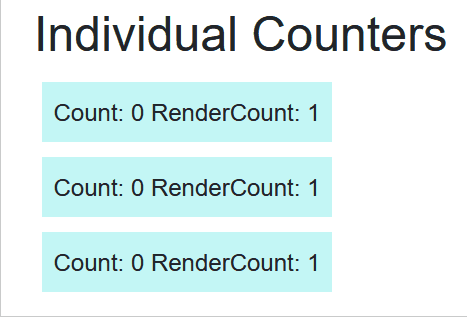

This repository is not affiliated with the creator of Fluxor.

Find the Fluxor repository at:

[https://github.com/mrpmorris/Fluxor](https://github.com/mrpmorris/Fluxor)

---

Links are at the bottom of the README.md 

One of which includes a published WebAssembly Blazor application that runs this repo's code.

Be sure to clear your cache if it appears you have an older cache of the WebAssembly site.

---

# Goal
Add the [Fluxor](https://github.com/mrpmorris/Fluxor) state management library which is a .NET implementation of the [Flux](https://facebook.github.io/flux/) state management application architecture.

Following that the next step is to make a PlainTextEditor using Fluxor as shown in this end result gif.



# Reasoning
The Flux state management application architecture helps drastically reduce the amount of mutable state in the application that occurs due to events firing.

As well Flux provides a single source of truth for state.

# Comments
## Problem Description
I find Flux can be repetitive when managing multiple instances of the same class as separate states.

This is due to the [FeatureState] (in respect to the Fluxor impelementation) being some kind of container. An example could be that the [FeatureState] is a Dictionary.

The Dictionary then looks up the state for a corresponding UI element using a key.

This results in the logic for that "immutable dictionary" being rewritten over and over for every class that is desired to be used many times for many state instances.

I am to make an abstraction for the "immutable dictionary" specifically with regards to Fluxor. The .NET built in ImmutableDictionary I do not believe fits this Fluxor state management case.

## Example Description
The most obvious example of this is a counter component in Blazor.

### Shared State Counter

<details>
  <summary>Example Of a Shared State Counter</summary>

  > The following image displays a CounterState that is shared among all instances of a Counter Blazor component.



<details>
  <summary>Construct a "FeatureState" class to hold the shared state of the counters.</summary>

```
// SharedCounterState.cs

using Fluxor;

namespace OpenSourceIde.ClassLibrary.Store.SharedCounter;

[FeatureState]
public record SharedCounterState(int Count)
{
    public SharedCounterState() : this(0)
    {
        
    }
}
```
</details>

<details>
  <summary>Construct a "Reducer" class to alter the "FeatureState" that holds the shared state of the counters.</summary>

```
// SharedCounterReducer.cs

using Fluxor;

namespace OpenSourceIde.ClassLibrary.Store.SharedCounter;

public class SharedCounterReducer
{
    [ReducerMethod(typeof(IncrementSharedCounterAction))]
    public static SharedCounterState ReduceIncrementSharedCounterAction(SharedCounterState previousSharedCounterState)
    {
        return previousSharedCounterState with 
        {
            Count = previousSharedCounterState.Count + 1
        };
    }
}
```
</details>

<details>
  <summary>Construct an "Action" class that identifies the OnClick event as to be handled by the "Reducer"</summary>

```
namespace OpenSourceIde.ClassLibrary.Store.SharedCounter;

public record IncrementSharedCounterAction();
```
</details>

<details>
  <summary>Construct a Blazor "FluxorComponent" that will render the shared state.</summary>

```
// SharedCounterDisplay.razor.cs

using Fluxor;
using Fluxor.Blazor.Web.Components;
using Microsoft.AspNetCore.Components;
using OpenSourceIde.ClassLibrary.Store.SharedCounter;

public partial class SharedCounterDisplay : FluxorComponent
{
    [Inject]
    private IState<SharedCounterState> SharedCounterState { get; set; } = null!;
    [Inject]
    private IDispatcher Dispatcher { get; set; } = null!;
    
    private void DispatchIncrementSharedCounterAction()
    {
        var action = new IncrementSharedCounterAction();

        Dispatcher.Dispatch(action);
    }
}
```

```
// SharedCounterDisplay.razor

@using Fluxor.Blazor.Web.Components

@inherits FluxorComponent

<div class="osi_shared-counter-display osi_unselectable"
     @onclick="DispatchIncrementSharedCounterAction">
    @SharedCounterState.Value.Count
</div>
```
</details>

</details>

---

### Individual State Counter

<details>
  <summary>Example Of an Individual State Counter</summary>

  > The following image displays a CounterState that is maintained individually per instance of a Counter Blazor component.



To implement a CounterState that is separate among all instances of a Counter Blazor component one can do the following:

<details>
  <summary>Construct a CounterRecord which is unrelated to fluxor to be stored in the "FeatureState" collection type.</summary>

```
namespace OpenSourceIde.ClassLibrary.Counter;

public record CounterRecord(int Count, SequenceRecordKey SequenceKey);
```

</details>

<details>
  <summary>Construct a CounterRecordKey which is unrelated to fluxor, but it will be used as a key for the "FeatureState" collection type which will be a Dictionary containing many CounterRecords.</summary>

```
namespace OpenSourceIde.ClassLibrary.Counter;

public record CounterRecordKey(Guid Id);
```

</details>

<details>
  <summary>Construct a SequenceRecordKey which is unrelated to fluxor, but when the "FeatureState" changes every individual blazor component that has their own state will rerender. The SequenceRecordKey will be used in the ShouldRender method which is native to Blazor components and will be overriden to check if the SequenceRecordKey changed. Only then should the component rerender.</summary>

```
namespace OpenSourceIde.ClassLibrary.Counter;

public record SequenceRecordKey(Guid Id);
```

</details>

<details>
  <summary>Construct a "FeatureState" class to hold the individual states of the counters.</summary>

```
using Fluxor;
using OpenSourceIde.ClassLibrary.Counter;

namespace OpenSourceIde.ClassLibrary.Store.IndividualCounter;

[FeatureState]
public record IndividualCounterState
{
    private Dictionary<CounterRecordKey, CounterRecord> _counterRecordMap;

    public IndividualCounterState()
    {
        _counterRecordMap = new();
    }

    public IndividualCounterState(IndividualCounterState otherIndividualCounterState)
    {
        _counterRecordMap = new(otherIndividualCounterState._counterRecordMap);
    }

    public IndividualCounterState WithAdd(CounterRecordKey counterRecordKey)
    {
        var nextIndividualCounterState = new IndividualCounterState(this);

        nextIndividualCounterState._counterRecordMap.Add(counterRecordKey, new(0, new SequenceRecordKey(Guid.NewGuid())));

        return nextIndividualCounterState;
    } 
        
    public IndividualCounterState WithReplace(CounterRecordKey counterRecordKey,
        CounterRecord replacementCounterStateRecord)
    {
        var nextIndividualCounterState = new IndividualCounterState(this);

        nextIndividualCounterState._counterRecordMap[counterRecordKey] = replacementCounterStateRecord;

        return nextIndividualCounterState;
    } 

    public CounterRecord LookupCounterRecord(CounterRecordKey counterRecordKey) => _counterRecordMap[counterRecordKey];
}
```

</details>

<details>
  <summary>Construct a "Reducer" class to alter the "FeatureState" that holds the individual states of the counters.</summary>

```
using Fluxor;

namespace OpenSourceIde.ClassLibrary.Store.IndividualCounter;

public class IndividualCounterReducer
{
    [ReducerMethod]
    public static IndividualCounterState ReduceRegisterIndividualCounterState(IndividualCounterState previousIndividualCounterState,
        RegisterIndividualCounterState registerIndividualCounterState)
    {
        return previousIndividualCounterState.WithAdd(registerIndividualCounterState.CounterRecordKey);
    }

    [ReducerMethod]
    public static IndividualCounterState ReduceIncrementIndividualCounterState(IndividualCounterState previousIndividualCounterState,
        IncrementIndividualCounterState incrementIndividualCounterState)
    {
        return previousIndividualCounterState.WithReplace(incrementIndividualCounterState.CounterRecordKey, 
            incrementIndividualCounterState.ReplacementCounterRecord);
    }
}
```

</details>

<details>
  <summary>Construct an "Action" class that identifies the increment OnClick event as to be handled by the "Reducer".</summary>

```
using OpenSourceIde.ClassLibrary.Counter;

namespace OpenSourceIde.ClassLibrary.Store.IndividualCounter;

public record IncrementIndividualCounterState(CounterRecordKey CounterRecordKey,
    CounterRecord ReplacementCounterRecord);
```

</details>

<details>
  <summary>Construct an "Action" class that allows an individual CounterRecord to be registered within the "FeatureState" collection.</summary>

```
using OpenSourceIde.ClassLibrary.Counter;

namespace OpenSourceIde.ClassLibrary.Store.IndividualCounter;

public record RegisterIndividualCounterState(CounterRecordKey CounterRecordKey);
```

</details>

<details>
  <summary>Construct a Blazor "FluxorComponent" that will render the individual state it is "given" (given in this example is a key that is used to lookup the individual state in the "FeatureState" which is a Dictionary).</summary>

```
// IndividualCounterDisplay.razor.cs

using Fluxor;
using Fluxor.Blazor.Web.Components;
using Microsoft.AspNetCore.Components;
using OpenSourceIde.ClassLibrary.Counter;
using OpenSourceIde.ClassLibrary.Store.IndividualCounter;

namespace OpenSourceIde.RazorClassLibrary.Counter;

public partial class IndividualCounterDisplay : FluxorComponent
{
    [Inject]
    private IState<IndividualCounterState> IndividualCounterState { get; set; } = null!;
    [Inject]
    private IDispatcher Dispatcher { get; set; } = null!;

    [Parameter, EditorRequired]
    public CounterRecordKey CounterRecordKey { get; set; } = null!;

    private CounterRecord? _cachedCounterRecord;
    private SequenceRecordKey? _previousCachedCounterRecordSequenceRecordKey;
    private int _renderCount;


    protected override async Task OnAfterRenderAsync(bool firstRender)
    {
        _renderCount++;

        if(firstRender)
        {
            try
            {
                var action = new RegisterIndividualCounterState(CounterRecordKey);

                Dispatcher.Dispatch(action);
            }
            catch(System.ArgumentException)
            {
                await InvokeAsync(StateHasChanged);
            }
        }

        await base.OnAfterRenderAsync(firstRender);
    }

    protected override bool ShouldRender()
    {
        var shouldRender = false;
        
        try
        {
            _cachedCounterRecord = IndividualCounterState.Value
                .LookupCounterRecord(CounterRecordKey);

            if(_previousCachedCounterRecordSequenceRecordKey is null ||
                _cachedCounterRecord.SequenceKey != _previousCachedCounterRecordSequenceRecordKey)
            {
                shouldRender = true;
            }

            _previousCachedCounterRecordSequenceRecordKey = _cachedCounterRecord.SequenceKey;
        }
        catch (KeyNotFoundException)
        {
            
        }

        return shouldRender;
    }

    private void DispatchIncrementSharedCounterAction()
    {
        var action = new IncrementIndividualCounterState(CounterRecordKey, _cachedCounterRecord! with 
        {
            Count = _cachedCounterRecord.Count + 1,
            SequenceKey = new SequenceRecordKey(Guid.NewGuid())
        });

        Dispatcher.Dispatch(action);
    }
}
```

```
// IndividualCounterDisplay.razor

@using Fluxor.Blazor.Web.Components

@inherits FluxorComponent

@if(_cachedCounterRecord is not null)
{
    <div class="osi_individual-counter-display osi_unselectable"
        @onclick="DispatchIncrementSharedCounterAction">

        Count: @_cachedCounterRecord.Count&nbsp;
        
        <OpenSourceIde.RazorClassLibrary.OnAfterRenderCounter.OnAfterRenderCounterDisplay RenderCount="_renderCount" />
    </div>
}

```
</details>

</details>

# Further Comments

The previously shown logic to implement individually maintained counter states never "unregisters" the individual counter state when the component is disposed.

One can override the Dispose method and dispatch an Action that removes the individual counter state.

---

The logic necessary to create many individual counter states is very repetitive in the sense that anytime one wishes to have many individual states of the same class the logic is repeated but with different key, value pairs in the "FeatureState" dictionary.

It is likely the case that one can abstract away the logic regarding many individual states of the same class.

---

## Links
- Azure host of the repo: [https://hunter-freeman-dev.azurewebsites.net/](https://hunter-freeman-dev.azurewebsites.net/)

- My email: hunterfreemandev@gmail.com

- My LinkedIn profile: [https://www.linkedin.com/in/hunter-freeman-7271a5176/](https://www.linkedin.com/in/hunter-freeman-7271a5176/)

- My Github profile: [https://github.com/huntercfreeman](https://github.com/huntercfreeman/)

- My Youtube channel: [https://www.youtube.com/channel/UCzhWhqYVP40as1MFUesQM9w/](https://www.youtube.com/channel/UCzhWhqYVP40as1MFUesQM9w/)

- My reddit profile: [https://www.reddit.com/user/hunter-freeman-dev](https://www.reddit.com/user/hunter-freeman-dev)

- Coffee: [Buy me a coffee](https://www.buymeacoffee.com/hunterfdev)